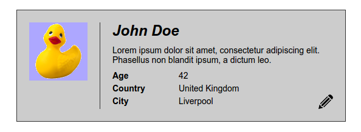
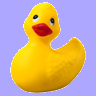

# exam-HTML-CSS-2016-05-17

## TODO
 - Fork this repository under your own account
 - Build this design:

 - Here are the assets:
   - Duck: 
   - Pencil icon: 
 - Please commit an HTML and a CSS file as well
 - You can use any resource online, beside help from others
 - Think about the semantic responsibilities of the elements
 - Write clean and valid code
 - Try to avoid code duplication
 - Use paint, gimp, or something similar to figure out the sizes and colors
 - You can use any lorem ipsum generator for the texts, it is not necessary to have the same
 - Don't worry about the position on the page, the element inner layout is the important
